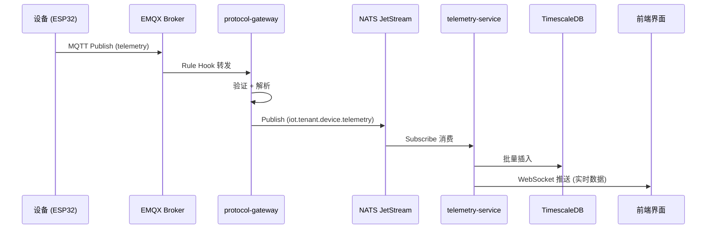
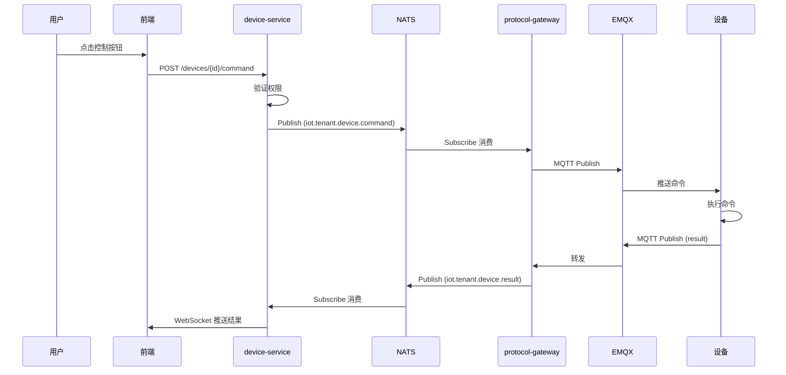
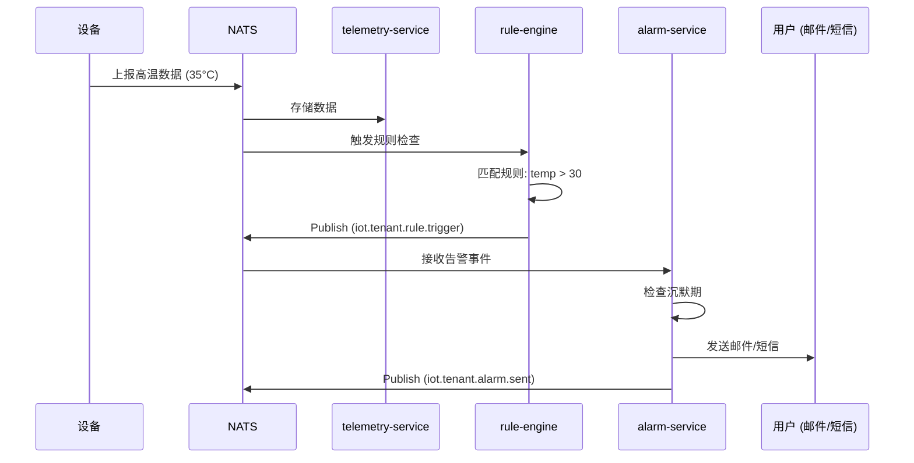
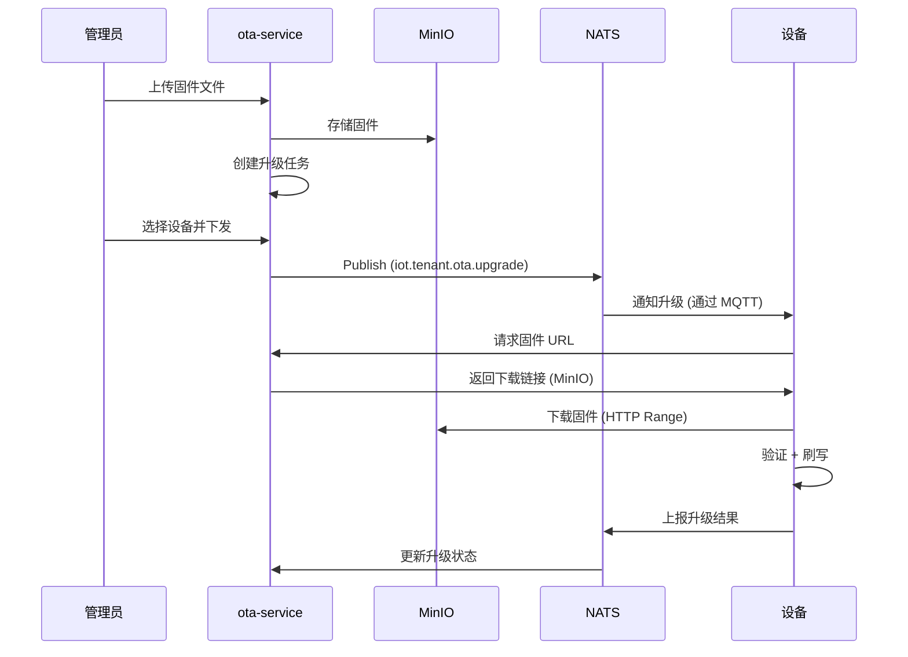
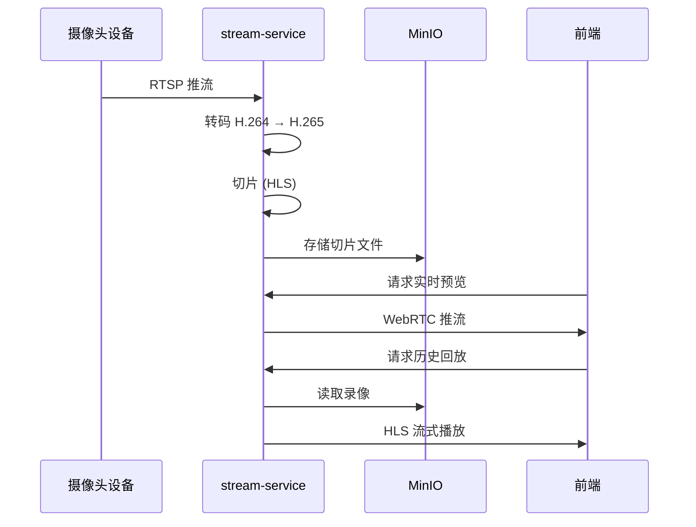

# 数据流设计文档

> **版本**: 1.0.0  
> **更新日期**: 2025-10-12

---

## 📊 一、数据流分类

根据数据量级和处理方式，我们将数据流分为三类：

### 1. 轻量数据流（传感器数据）

**特征**:
- 数据量小（几字节到几KB）
- 频率高（秒级/分钟级）
- 需要实时处理
- 需要长期存储

**流转路径**:
```
设备 (ESP32/STM32)
  ↓ MQTT publish: iot/tenant_001/device_001/telemetry
EMQX Broker
  ↓ Rule Hook 转发
protocol-gateway
  ↓ 解析并发布 NATS: iot.tenant_001.device.device_001.telemetry
telemetry-service (订阅 NATS)
  ↓ 验证 + 存储
TimescaleDB
  ↓ 查询
frontend / analytics-service
```

**数据格式**:
```json
{
  "deviceId": "device_001",
  "tenantId": "tenant_001",
  "timestamp": 1697097600000,
  "data": {
    "temperature": 25.5,
    "humidity": 60,
    "pressure": 1013.25
  },
  "metadata": {
    "rssi": -65,
    "battery": 85
  }
}
```

---

### 2. 中等数据流（日志/事件）

**特征**:
- 数据量中等（几KB到几MB）
- 频率中等（分钟级/小时级）
- 需要异步处理
- 存储周期较短

**流转路径**:
```
设备 / 服务
  ↓ 发布事件
NATS JetStream (持久化)
  ↓ 消费组处理
analytics-service / rule-engine
  ↓ 分析处理
PostgreSQL / ClickHouse
  ↓ 报表查询
frontend Dashboard
```

**应用场景**:
- 设备日志上报
- 系统事件记录
- 操作审计
- 状态变更通知

---

### 3. 重量数据流（视频/文件）

**特征**:
- 数据量大（MB到GB级）
- 频率低或按需
- 需要流式处理
- 需要对象存储

**流转路径**:
```
视频设备
  ↓ RTSP/WebRTC 流
stream-service
  ↓ 转码 + 切片
MinIO (对象存储)
  ↓ 按需回放
frontend Video Player

文件上传
  ↓ HTTP Multipart
device-service / ota-service
  ↓ 存储
MinIO
  ↓ CDN 分发
设备下载
```

---

## 🔄 二、典型数据流场景

### 场景 1: 设备遥测数据上报



**时序说明**:
1. 设备每 10 秒上报一次传感器数据
2. EMQX 立即转发到 protocol-gateway
3. protocol-gateway 解析后发布到 NATS (< 5ms)
4. telemetry-service 批量写入数据库 (每秒或每 1000 条)
5. 前端通过 WebSocket 实时显示 (延迟 < 100ms)

---

### 场景 2: 设备命令下发



---

### 场景 3: 规则引擎触发告警



**规则配置示例**:
```json
{
  "ruleId": "temp_alert",
  "tenantId": "tenant_001",  // ✅ 应该有这个
  "name": "高温告警",
  "condition": {
    "metric": "temperature",
    "operator": ">",
    "threshold": 30,
    "duration": "5m"
  },
  "actions": [
    {
      "type": "alarm",
      "level": "warning",
      "notify": ["email", "sms"]
    },
    {
      "type": "device_command",
      "deviceId": "fan_001",
      "command": "turn_on"
    }
  ]
}
```

---

### 场景 4: OTA 固件升级



**固件元数据**:
```json
{
  "firmwareId": "fw_v2.1.0",
  "version": "2.1.0",
  "targetDevices": ["ESP32"],
  "fileSize": 1048576,
  "md5": "abc123...",
  "url": "https://minio.local/firmware/fw_v2.1.0.bin",
  "releaseNotes": "修复已知问题，优化性能"
}
```

---

### 场景 5: 视频流处理



**视频存储策略**:
- 实时流：WebRTC，延迟 < 500ms
- 录像存储：HLS 切片，每片 10 秒
- 保留策略：最近 7 天全量，7-30 天关键帧，30 天后删除

---

## 🔀 三、NATS Subject 设计规范

### Subject 命名规则

```
格式: iot.{tenant_id}.{category}.{resource_id}.{action}

示例:
iot.tenant_001.device.device_001.telemetry      # 设备遥测
iot.tenant_001.device.device_001.status         # 设备状态
iot.tenant_001.device.device_001.command        # 设备命令
iot.tenant_001.device.device_001.command.result # 命令结果
iot.tenant_001.rule.rule_001.trigger            # 规则触发
iot.tenant_001.alarm.alarm_001.notify           # 告警通知
iot.tenant_001.ota.task_001.progress            # OTA 进度
```

### 通配符订阅

```bash
# 订阅某租户的所有设备遥测
iot.tenant_001.device.*.telemetry

# 订阅某设备的所有消息
iot.tenant_001.device.device_001.*

# 订阅所有租户的告警（仅管理员）
iot.*.alarm.*.notify
```

---

## 📦 四、消息格式规范

### 统一消息信封

所有通过 NATS 传递的消息都遵循统一格式：

```typescript
interface MessageEnvelope {
  // 消息元数据
  messageId: string;          // 唯一消息 ID
  timestamp: number;          // Unix 时间戳 (毫秒)
  tenantId: string;           // 租户 ID
  source: string;             // 消息来源服务
  
  // 消息类型
  type: string;               // telemetry | command | event | alarm
  
  // 业务数据
  payload: any;               // 业务数据
  
  // 可选字段
  correlationId?: string;     // 关联 ID（用于追踪）
  replyTo?: string;           // 响应主题
  ttl?: number;               // 消息过期时间 (秒)
}
```

### 设备遥测消息

```json
{
  "messageId": "msg_123456",
  "timestamp": 1697097600000,
  "tenantId": "tenant_001",
  "source": "protocol-gateway",
  "type": "telemetry",
  "payload": {
    "deviceId": "device_001",
    "data": {
      "temperature": 25.5,
      "humidity": 60
    },
    "metadata": {
      "rssi": -65,
      "battery": 85
    }
  }
}
```

### 设备命令消息

```json
{
  "messageId": "cmd_789012",
  "timestamp": 1697097610000,
  "tenantId": "tenant_001",
  "source": "device-service",
  "type": "command",
  "payload": {
    "deviceId": "device_001",
    "command": "set_temperature",
    "params": {
      "target": 22
    }
  },
  "correlationId": "req_456",
  "replyTo": "iot.tenant_001.device.device_001.command.result",
  "ttl": 30
}
```

### 规则触发消息

```json
{
  "messageId": "rule_345678",
  "timestamp": 1697097620000,
  "tenantId": "tenant_001",
  "source": "rule-engine",
  "type": "event",
  "payload": {
    "ruleId": "temp_alert",
    "ruleName": "高温告警",
    "deviceId": "device_001",
    "condition": "temperature > 30",
    "currentValue": 35.2,
    "severity": "warning"
  }
}
```

---

## ⚡ 五、性能优化策略

### 1. 批量写入优化

**telemetry-service** 使用批量写入：

```typescript
// 缓冲区设计
const BATCH_SIZE = 1000;        // 每批次最多 1000 条
const BATCH_TIMEOUT = 1000;     // 1 秒超时

const buffer: TelemetryData[] = [];

async function addToBuffer(data: TelemetryData) {
  buffer.push(data);
  
  if (buffer.length >= BATCH_SIZE) {
    await flushBuffer();
  }
}

async function flushBuffer() {
  if (buffer.length === 0) return;
  
  const batch = buffer.splice(0);
  await timescaledb.batchInsert(batch);
}

// 定时刷新
setInterval(flushBuffer, BATCH_TIMEOUT);
```

**优势**:
- 减少数据库连接次数
- 提高写入吞吐量
- 降低数据库负载

---

### 2. 数据采样策略

对于高频数据，实施分级采样：

```
原始数据:
  - 最近 24 小时: 全量存储 (10 秒间隔)
  - 最近 7 天: 1 分钟聚合
  - 最近 30 天: 5 分钟聚合
  - 30 天以上: 1 小时聚合
```

**TimescaleDB 连续聚合**:
```sql
-- 创建 1 分钟聚合视图
CREATE MATERIALIZED VIEW telemetry_1min
WITH (timescaledb.continuous) AS
SELECT
  time_bucket('1 minute', time) AS bucket,
  device_id,
  metric,
  AVG(value) AS avg_value,
  MAX(value) AS max_value,
  MIN(value) AS min_value
FROM telemetry
GROUP BY bucket, device_id, metric;

-- 自动刷新策略
SELECT add_continuous_aggregate_policy('telemetry_1min',
  start_offset => INTERVAL '2 hours',
  end_offset => INTERVAL '1 minute',
  schedule_interval => INTERVAL '1 minute');
```

---

### 3. 缓存策略

使用 Redis 缓存热数据：

```
设备最新状态:
  Key: device:latest:{device_id}
  TTL: 300s
  Value: JSON (最新的遥测数据)

设备统计信息:
  Key: device:stats:{device_id}:24h
  TTL: 3600s
  Value: JSON (24小时统计)

租户设备列表:
  Key: tenant:devices:{tenant_id}
  Type: Set
  Members: device_id 列表
```

---

### 4. 消息压缩

对于大量小消息，启用压缩：

```typescript
// NATS 消息压缩
const nc = await connect({
  servers: 'nats://localhost:4222',
  compression: true  // 启用压缩
});
```

---

## 🔍 六、数据查询优化

### 时序数据查询最佳实践

```sql
-- ❌ 不好的查询（全表扫描）
SELECT * FROM telemetry 
WHERE device_id = 'device_001' 
ORDER BY time DESC 
LIMIT 100;

-- ✅ 优化后的查询（指定时间范围）
SELECT * FROM telemetry 
WHERE device_id = 'device_001' 
  AND time > NOW() - INTERVAL '24 hours'
ORDER BY time DESC 
LIMIT 100;

-- ✅ 使用聚合视图查询历史数据
SELECT * FROM telemetry_1min
WHERE device_id = 'device_001'
  AND bucket > NOW() - INTERVAL '7 days'
ORDER BY bucket DESC;
```

### 索引策略

```sql
-- 复合索引优化查询
CREATE INDEX idx_telemetry_device_time 
ON telemetry (device_id, time DESC);

CREATE INDEX idx_telemetry_tenant_time 
ON telemetry (tenant_id, time DESC);

-- JSONB 索引（用于标签查询）
CREATE INDEX idx_telemetry_tags 
ON telemetry USING GIN (tags);
```

---

## 📈 七、数据流监控

### 关键指标

```yaml
消息吞吐量:
  - nats_messages_in_rate: 入站消息速率
  - nats_messages_out_rate: 出站消息速率
  - nats_bytes_in: 入站字节数
  - nats_bytes_out: 出站字节数

处理延迟:
  - message_processing_duration: 消息处理时间
  - e2e_latency: 端到端延迟（设备到数据库）

数据存储:
  - timescaledb_insert_rate: 插入速率
  - timescaledb_disk_usage: 磁盘使用量
  - redis_memory_usage: Redis 内存使用

队列状态:
  - nats_pending_messages: 待处理消息数
  - nats_consumer_lag: 消费者延迟
```

---

## 🎯 八、数据流总结

### 设计原则

1. **异步优先**: 使用消息队列解耦
2. **批量处理**: 减少数据库压力
3. **分级存储**: 根据数据特征选择存储方案
4. **缓存热数据**: 提高查询性能
5. **监控可观测**: 全链路追踪

### 数据流对比

| 数据类型 | 协议 | 存储 | 延迟 | 保留期 |
|---------|------|------|------|--------|
| 传感器数据 | MQTT → NATS | TimescaleDB | < 100ms | 1年 |
| 设备日志 | MQTT → NATS | PostgreSQL | < 500ms | 6个月 |
| 视频流 | RTSP | MinIO | < 2s | 30天 |
| 固件文件 | HTTP | MinIO | 按需 | 永久 |
| 实时通知 | WebSocket | 不存储 | < 50ms | - |

---

**文档维护者**: Fountain IoT Team  
**最后更新**: 2025-10-12

